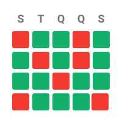
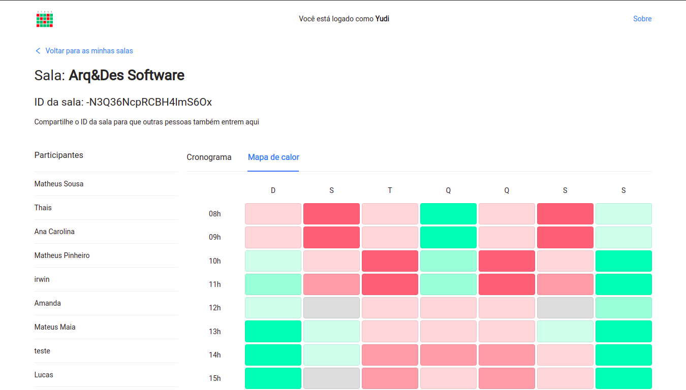

<!-- README original -->
<!-- https://github.com/othneildrew/Best-README-Template -->
<!-- RAW https://raw.githubusercontent.com/othneildrew/Best-README-Template/master/README.md -->
<br />
<div align="center">
  <a href="https://github.com/othneildrew/Best-README-Template">
    
  </a>

  <h2 align="center">Bora Marcar</h2>

  <p align="center">
    Encontre e visualize horários em comum para o seu grupo. Fácil e rápido de usar.
    <br />
    <a href="https://boramarcar.vercel.app">Veja funcionando</a>
    <!-- ·
    <a style="pointer-events: none; display: inline-block; color: grey;" href="#">
      Achou um bug? Clique aqui</a>
    ·
    <a style="pointer-events: none; display: inline-block; color: grey;" href="#">
      Mais funcionalidades</a> -->
  </p>
</div>

<br />

## Visão geral



**Bora Marcar** é uma aplicação para ajudar você e seu grupo a encontrar os
melhores horários para uma reunião ou um rolê qualquer.

### Tecnologias

- React + TypeScript
- Firebase (Realtime Database)
- Vite

## Montar ambiente de desenvolvimento

Comece clonando o repositório e entre nele:

```sh
git clone https://github.com/yudi-azvd/heatmap-schedule.git
cd heatmap-schedule
```

Siga o restante das instruções nesse [guia](/docs/setup-dev-environment.md).

Se deu tudo certo, você pode interagir com a aplicação digitando esse endereço
no seu navegador http://localhost:3000.

## Notas de desenvolvimento

Se você quiser o que se passa na minha cabeça durante o desenvolvimento desse
projeto, você pode ler o [devnotes](./docs/devnotes.md).

## Agradecimentos

@Edmundo-Ribeiro pelo nome do projeto. Nome simples, curto e fácil de entender.
