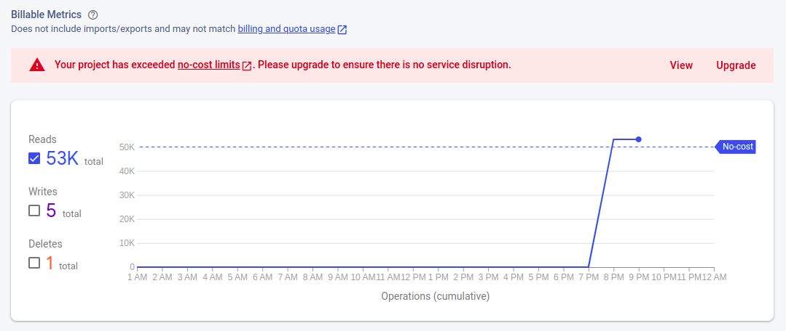

# Notas de desenvolvimento
A ordem cronológica dessas anotações é de baixo para cima, seguindo as datas. 
Talvez tenha uma sentença ou outra que não faça todo o sentido. Essas notas
devem fazer sentido pelo menos pra mim. Se você entender alguma coisa é lucro.
Ainda assim, você é bem vindo em tentar xD

## Objetivos desse projeto 
Arquitetura limpa. É uma tentativa de fazer algo parecido com esse projeto do
Rodrigo Manguinho.

Acho que um bom indicador se isso funcionou é a facilidade de substituir React 
por outro framework ou de substituir serverless pelo modelo cliente servidor + 
socket, pra depois ficar fácil de trocar o frontend ou backend completamente por
outra stack.

Agora, sim, as notas:

## 2022-05-15 - Parece promissor

Depois da bagunça que aconteceu ontem na branch `firebase-integration-messy`,
voltei pra `dev` pra refazer algumas coisas. Dei um nome pro tipo 
`{ [key in DayTime]?: TimbeboxValue }`, que agora é `Schedule`. Tinha um 
componente que se chamava `Schedule`, mas renomeei para `ScheduleBoard`. Sinto
que vai acontecer algo parecido com `DayTime`, `TimeboxValue` e `Timebox`
(o componente).

Antes existia apenas `ScheduleBoard` usando `fakeScheduleRepository`. Na branch
de integração com Firebase, o repositório foi substituído por variáveis
de estado em `ScheduleOrHeatmap`. Eu tava usando essa ideia de repositório 
porque eu imaginava que os dados `fakeScheduleRepository` seriam usados em outro
lugar. Deve ser um alerta: toda vez que eu pensar em repositório em um projeto 
React, provavelmente eu quero usar Estado.

## 2022-05-15
Mudei os componentes `Schedule` e `Heatmap` para `ScheduleBoard` e `HeatmapBoard`
, respectvamente. 

`ScheduleBoard` representa o cronograma de um usuário em determinada sala.
`HeatmapBoard` representa os cronogramas de vários usuários em uma determinada
sala. Como a sala não muda na página 

`ScheduleBoard` depende e uma sala e de um usuário apenas, que devem ser conhecidos
no carregamento da página que contém `ScheduleBoard`. Por isso decidi simplificar
as suas funções de "serviço" pra não precisarem dos IDs do usuário e sala.


## 2022-05-15

Tenho que repensar o fluxo de dados do `ScheduleOrHeatmap`. 

Tenho que repensar o as dependências de `Heatmap`.

## 2022-05-14 - Sobre o Firestore...

Em menos de 1 hora eu atingi o limite de 50k leituras na Firestore com no máximo
5 documentos rodando a aplicação em ambiente local de desenvolvimento.



Fazendo umas contas rapidamente: a página onde eu usei a função `getUsers` é a
página inicial do protótipo. Se eu salvo o arquivo da página, a função `getUsers`
é chamada 2 vezes pra ler os 5 documentos cada uma dessas vezes. Eu podia
ter diminuido de 2 pra 1 vez se eu tivesse colocado `getUsers` no useEffect que
já existia :facepalm:.

Então, se eu não estiver enganado, a cada Ctrl + S ou F5, a aplicação faz 10 leituras
na Firestore. Aparentemente eu salvei esse arquivo ou atualizei a página umas 5 mil
vezes.

No Reddit disseram que esse número de leituras pode vir também do console da 
Firestore. De qualquer maneira, isso abordagem não sobreviveria ao teste com
usuários reais mesmo se eu tivesse colocado tudo no mesmo useEffect.

Ainda bem que eu tô no plano grátis. Se um dia eu utilizar o plano pago eu tenho
que me certificar de ligar alertas de billing.

Vou tentar Realtime Database do Firebase.

## 2022-05-14 - ainda mais tarde

Minha dúvida atual é sobre como fazer um mini ambiente de stage, em que várias
pessoas podem usar a aplicação. 

**O Problema**: a aplicação tem que reagir à mudanças nos cronogramas do usuários
da sala pra calcular o mapa de calor. Atualmente isso já acontece para o usuário
local "apenas na minha máquina". A aplicação tem que "perceber" e reagir às
mudanças de cronogramas, como se ele se inscrevesse num evento e quando esse 
evento acontece, ela executa um callback.

**Solução 1** SocketIO. A versão anterior dessa aplicação tinha um servidor com
socket. O usuário podia mudar os horários no cronograma e o servidor imprimia
o ID do usuário e o novo valor do Timebox. 

**Solução 2** Firebase. Nunca mexi, só vi alguns vídeos. Mas sei que é possível
executar um callback quando ocorre alguma mundança no banco de dados.

Tô inclinado na **solução 1**. Já tem um servidor quase pronto com sockets. O 
próximo passo seria abstrair essa reação a eventos em uma interface pra não 
depender de SocketIO ou Firebase diretamente. Depois eu faria a implementação
definitiva em Firebase.

Por que não começar logo com Firebase? Acho que é o _receio_ de ficar muito tempo
travado tentando encaixar o Firebase na aplicação (ler documentação). Começando
com sockets eu começaria pelo conhecido, criaria uma abstração para reagir a 
eventos e depois colocaria o Firebase por baixo. Sim, parece mais que dá mais
trabalho, mas acho que esse é o caminho menos frustrante pra entregar um mini 
ambiente de stage, em que várias pessoas podem usar a aplicação. Quando eu terminar
a gambiarra com SocketIO, já vou poder pedir feedback pras pessoas. E acho que 
posso aprender mais assim também.

Links úteis sobre Firebase e emuladores:

- [Um tutorial](https://www.freecodecamp.org/news/the-firestore-tutorial-for-2020-learn-by-example/),
tem um exemplo de inscrever na mudança de documento.
- [Instalar e configurar](https://firebase.google.com/docs/emulator-suite/install_and_configure)
- [Conectar e prototipar](https://firebase.google.com/docs/emulator-suite/connect_and_prototype#web-version-9_1)
- [Add firebase to your project](https://firebase.google.com/docs/web/setup)

Lendo esses links por cima me fez achar menos complicado começar por Firebase...

Então vamos de Firebase.

## 2022-05-14 - algumas horas depois
Estimar quanto tempo vai levar pra concluir o projeto 

- definir tasks/histórias de usuário
- planilha de previsão do término (só pra ter uma noção)

Planos futuros:

- fazer um servidor dummy pra funcionae como API de cronograma de maneira que 
varias pessoas possam usar a aplicação na mesma sala
    - servidor vai ter que resolver ID dos usuários?
    - uma página pra escolher o nome e vai ser redirecionado para o dashboard
    - rota de teste /reset-users pra resetar os cronogramas de quem está presente
    - rota de teste /kick-users pra apagar/kickar os usuários da sala e fazer um cleanup
    - rota de teste /list-users pra listar os usuários da sala
    - rota de teste /show-user-schedule pra listar o cronograma de um usuário 
    dado um ID


## 2022-05-14 
Nenhuma ordem em particular. É um dump das coisas que eu tava pensando enquanto
desenvolvia, mas que acabei escrevendo apenas agora.

### Desenvolvimento incremental
- Primeiro fiz apenas o Schedule funcionando com dias e horários hard coded.

Comparar com a primeira abordagem

Tinha começado com a primeira página do ponto
de vista do usuário: login/cadastro. Isso dificultou um pouco o restante do 
desenvolvimento porque quando cheguei no `Schedule` eu já tava pensando em 
termos de ContextAPI pra pegar os dados do usuário e etc. Claro que dava
pra começar pelo login/cadastro sem essas dificuldades, mas depois de ler esse 
[post](https://www.linkedin.com/posts/akitaonrails_toda-vez-que-eu-vejo-um-teste-de-programa%C3%A7%C3%A3o-activity-6916745763079217153-KoGR?utm_source=linkedin_share&utm_medium=member_desktop_web) eu me 
toquei que tinha que começar pelo mais importante, que é indicado no próprio 
nome da aplicação: cronograma e mapa de calor. Como eu quero que outras pessoas 
achem essa aplicação útil, tenho que receber feedback sobre o core da aplicação 
o quanto antes.

Outra "filosofia" que mantive durante o desenvolvimento dessa vez, foi a "outra
parte vai resolver isso aqui". Em vez de fazer a requisição do cronograma do 
usuário em `Schedule`, decidi que ele já os receberia como argumentos. E mais
depois ainda decidi que `Schedule` receberia uma dependência responsável por
pegar esses dados. Outro exemplo? Qual a vantagem de fazer isso? Não sei, to 
testando. Tentando fazer diferente do que normalmente faço.


### Mudanças em geral
Fazer mudanças com testes unitários é uma beleza. É paz e tranquilidade na 
consciência do desenvolvedor. Se ele errar qualquer coisa ele será notificado
pela execução dos testes. 

### Mudanças em algumas interfaces
As interfaces são as partes mais importantes do projeto. Mudei ela uma vez e a 
mudança repercutiu em "muitos" outros lugares.

Minha **primeira abordagem** foi de passar um repositório de cronograma 
(`ScheduleRepository`) como depedência para o componente `Schedule`. De cara 
estranhei um pouco essa abordagem porque parece muito coisa de backend. O 
componente `Schedule` usava dois métodos do repositório: `getAll` pra pegar o 
cronograma do usuário e `updateAlgumaCoisa` pra atualizar um horário do usuário
quando ele clica num quadradinho.

Na hora do desenvolvimento, acabei percebendo que tinha que atualizar
o componente `Heatmap` quando o usuário clica em algum quadradinho do `Schedule`.
Uma chamada de método dentro de `Schedule` deveria causar uma mudança de estado
em `Heatmap`. Lembrando que `Schedule` e `Heatmap` são componentes filhos de
`ScheduleOrHeatmap` mais ou menos assim:

```jsx
<ScheduleOrHeatmap>
  <Schedule scheduleRepository={fakeScheduleRepository} {/* ... */} />
  <Heatmap users={users} {/* ... */} />
</ScheduleOrHeatmap>
```

Como a única atualização do cronograma do usuário é feita por 
`fakeScheduleRepository.update` eu teria que acrescentar uma lógica de atualização
de estado de `Heatmap` _dentro_ de `FakeScheduleRepository`. Isso me pareceu muita
bagunça mesmo pra uma implementação em "protótipo". Além disso, eu acreditava que
essa abordagem não refletiria um fluxo de dados que lembraria o fluxo de dados
em produção. Vou chamar essa abordagem de **abordagem baguncinha**.

Então acabei trocando o repositório por duas funções. Elas são 
`GetUserScheduleInThisRoom` e `UpdateUserScheduleInThisRoom` e aceitam os mesmos
argumentos que os métodos do antigo repositório. Essas funções têm as seguintes
assinaturas:

```ts
export interface GetUserScheduleInThisRoom {
  (getAllSchedule: GetUserScheduleDTO): Promise<Schedule>
}

export interface UpdateUserScheduleInThisRoom {
  (updateSchedule: UpdateScheduleDTO): Promise<void>
}
```

Acho que a vantangem dessa **segunda abordagem** é que eu posso usar qualquer 
implentação de `UpdateUserScheduleInThisRoom` e passar para `Schedule`. 
Incluindo uma implementação que chama `fakeScheduleRepository.update`. Mas agora
o componente `Schedule` depende apenas das funções e não de um repositório.

Uma **terceira abordagem** de fazer isso, ainda parecida coma **segunda 
abordagem**, seria substituir essas funções por objetos de classe de serviço ou 
classe de caso de uso que implementam as seguintes interfaces:

```ts
interface UpdateUserScheduleInThisRoomService {
  run: (updateSchedule: UpdateScheduleDTO) => Promise<void>
}

interface GetUserScheduleInThisRoom {
  run: (getAllSchedule: GetUserScheduleDTO) => 
    Promise<Schedule>
}
```

E na "main" eu teria algo como `FakeUpdateUserScheduleInThisRoomService`, que
implmenratia `UpdateUserScheduleInThisRoomService` e cujo método `run` executaria
uma função que causaria uma mudança de estado em `Heatmap`.

Se você parar pra pensar, a **terceira abordagem** não é _tão_ diferente da 
**abordagem baguncinha**. Tanto o repositório fake da **abordagem baguncinha**
quanto os serviços fake da **abordagem baguncinha** implementam uma  interface 
da qual `Schedule` depende. Nessas duas abordagens, `Schedule` depende de métodos
que executam um rotina qualquer. Além disso, o fluxo de dados da abordagem 
baguncinha tbm é quase igual ao da terceira/segunda abordagem A maior diferença 
é que as operações `get` e `update` estão separadas em interfaces diferentes, o 
que está mais condizente com o 
[Interface Segregation Principle](https://en.wikipedia.org/wiki/Interface_segregation_principle)
do [SOLID](https://en.wikipedia.org/wiki/SOLID). 

Acho que essa mudança de nomes foi, na verdade, o meu subconsciente me guiando
para longe da ideia nomes com `Repository` no frontend. Vai saber.


### Testes
- O que eu achei de TDD, Jest e tempo de execução dos testes
devagar
- Talvez TDD não valha à pena. Talvez seja melhor testes E2E
- Preciso aprender mais sobre snapshot do Jest e `waitFor` e `act` do React Testing
library.

### "Espaço" de desenvolvimento
Puxar um pouco das ideias de desenvolvimentos de jogos:
pequenos laboraórios dentro projeto, assim como cenas no Godot. O jogo principal,
a "main" ainda existe ao lado desses pequenos laboratórios. No Godot é possível
executar cada um desses laboratórios individual e isoladamente. 

Em desenvolvimento de jogos não é necessário abrir o jogo, apertar os botões do 
menu, vencer a fase 1, vencer a fase 2 pra testar a fase 3. Quero explorar essa 
mesma mentalidade em no desenvolvimento dessa aplicação (e de outras também): 
pra testar o cronograma eu não preciso passar pela tela login, o cronograma não 
precisa estar implentado. O mapa de calor pode funcionar de forma independente do 
cronograma. Por mais que na aplicação final o mapa de calor dependa dos
cronogramas de todos os usuários, ele de verdade só precisa indicar quantas
pessoas estão disponíveis e ocupadas nos dias e horários, ou seja, ele só precisa
de _dados_ e não do cronograma.

**Ideia**: usar variáveis ambiente (`.env`) para o app saber qual "laboratório"
ele deve executar. Essa estratégia também deve funcionar no pipeline de CI (?).

Uma complicação que eu vejo é como coordenar isso em um time.

### Antiga
Antiga estilização das `div` do Schedule e Heatmap

```css
  > div#top-left {
    border-bottom: 1px solid rgba(0, 0, 0, 0.1);
    border-right: 1px solid rgba(0, 0, 0, 0.1);
  }

  > div.day {
    position: relative;

    &::after {
      position: absolute;
      content: '';
      background: rgba(0, 0, 0, 0.1);
      height: 100%;
      width: 1px;
      right: -3px;
    }
  }

  > div.time {
    position: relative;

    &::after {
      position: absolute;
      content: '';
      background: rgba(0, 0, 0, 0.1);
      height: 1px;
      width: 100%;
      bottom: -3px;
    }
  }
```

## 2022-??-??

Tava muito perdido se ia fazer com  TDD, se só ia fazer algumas páginas. Não
sabia se ia usar um modelo cliente/servidor ou serverless com Firebase. Eu não
sabia se ia fazer um MVP, uma PoC, um protótipo com gambiarras ou uma versão 
definitiva com código limpo.

Era só confusão e ansiedade.